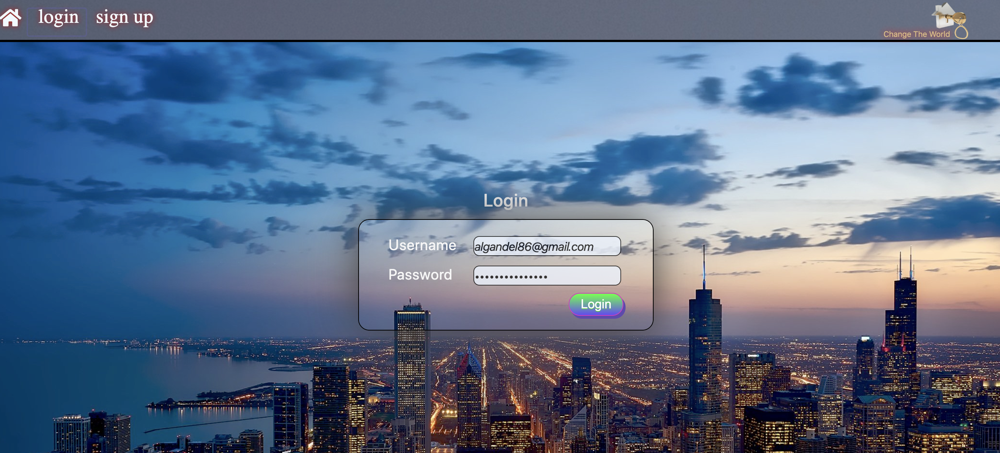
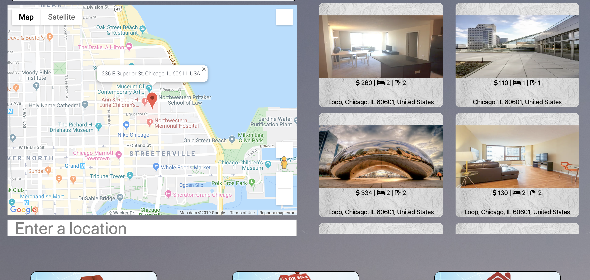
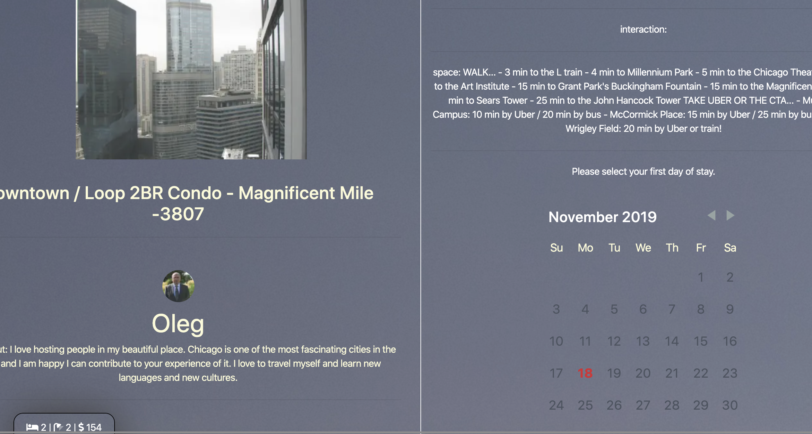

# Change the World

   Our project is about rental apartments .
Visiting City of Chicago and looking for Apartments that you like to stay in?
Then this web application we provide is the best fit for you!
Find your cozy Apartment to stay for the night.
This Web application helps user finding the perfect rental apartments. Also you can find your next rental from search view in your targeted area anywhere in Chicago area.

[Live Link](https://glacial-plateau-39877.herokuapp.com/)

## Login Page 

## Sign Up Page

## Main Page

## Specific Page

## Technologies used:

   * React
   * React Helmet
   * React Bootstrap
   * Font Awesome
   * Googel Map Api
   * Airbnb Api
   * Node
   * Express
   * MongoDB
   * Mongoose ORM
   * Sequelize
   * Body Parser
   * Passport

## Functionality:

   * Payment methods 
   * Connecting Calendar with DB
   * User ability to poste

